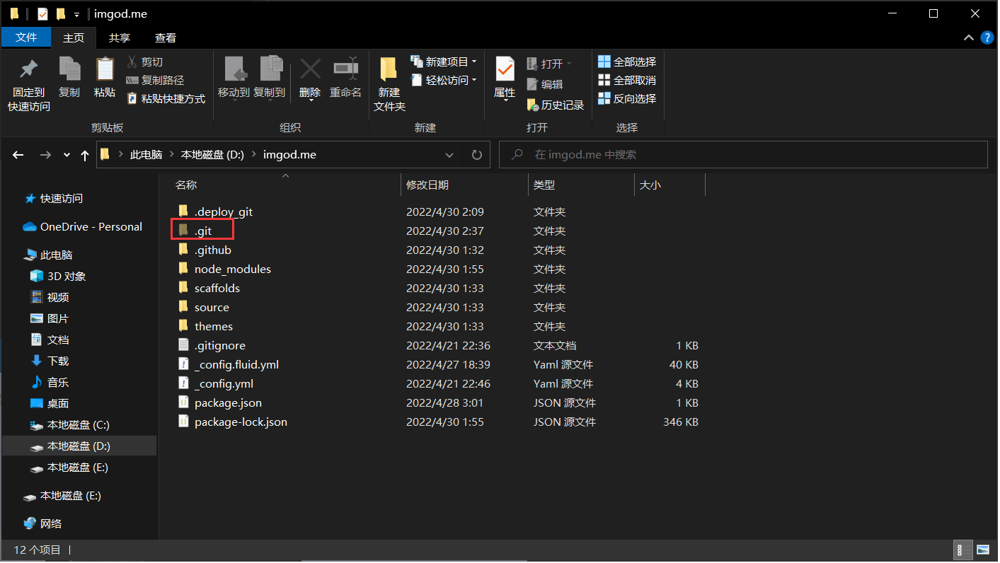

##  多设备同步更新

### 简介

在台式机上搭建了hexo博客后，想要笔记本电脑上进行文章的编写与上传，记录下操作步骤

### 旧电脑

##### 1. 创建新分支

我们创建一个名为`backup`的分支


##### 2. 将新分支设为默认分支

博客项目存储库设置-分支-修改默认分支即可


##### 3. 将分支克隆到本地

这里注意,尽量不要和原博客文件夹在同一路径,如果像我一样库名称和本地问价夹名称相同会出问题(实在不懂什么意思就把原博客文件夹备份一下,出问题还能救)


##### 4.  将`.git`文件夹复制到博客根目录

如果看不到`.git`文件夹就去 windows 此电脑-查看-隐藏的项目勾选上整个文件夹直接替换掉原博客文件夹下的`.git`文件夹即可



##### 5. 将文件添加到暂存区

`git add –A`

##### 6. 提交到本地仓库

`git commit -m "backup"`

##### 7. 推送到`backup`分支

`git push origin backup`

### 新电脑

##### 1. 将分支克隆到本地

`git clone 仓库地址`

##### 2. 安装依赖

`npm install`

### 所有电脑每次更新

##### 都要执行以下指令

(修改完成后直接点击下面代码块右上角`Copy`全部粘贴到 Git Bash 即可)

```shell
git pull
git add -A
git commit -m "backup"
git push origin backup
hexo cl
hexo g
hexo d
```
