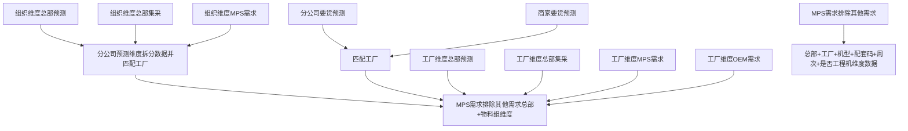

#### 生成分公司维度数据（线下）

1. 拆分总部预测、 总部集采、`MPS`需求(总部维度)到分公司，插入临时表
   1. 准备数据（区分类型）
      1. 获取当前周分公司协同版数据（受限要货计划），随便取总部订单版本中的一个周次对型号进行筛选（我并没发现总部订单版本的机型范围比分公司协同版的机型范围小）
      2. <u>分公司预测期外</u> 用分公司预测最后四周的数据（套路同上）
   2. 按周次、机型、数据类型分组，如果在组内某类型对应的某型号合计为0，那就分组内所有的数量都赋值为1，其实就是让所有分公司对指定机型的分配比例相同
   3. 分解数据
      1. 根据版本ID和数据类型筛选出当前周工厂为空的总部订单到【型号 + 周次】维度的调整量进行循环分解
         - 得到准备数据在【型号+周次+类型】维度的总数，如果合计为0则退出循环
         - 按比例进行第一次拆分,如果结果为小数，则去掉小数位
         - 得到第一次拆分后的总数
         - 计算总误差值
         - 根据各条数据的误差从大到小排序，依次加1, 直到消除总误差
2. 获取总部订单数据中类型为分公司预测和商家预测的分公司数据，插入临时表
3. 分公司预测数量与常规订单下单数量取大值
4. 以上获取到的分公司维度数据插入当前周工厂订单版本并匹配工厂
   1. 将临时表中分公司维度的总部订单版本数据插入工厂订单版本中做数据初始化
   2. 匹配工厂
      1. 如果【机型+工厂+配套码】维度在工厂供应机型表中唯一，那就使用唯一的工厂供应机型数据匹配工厂
      2. 型号补货路径优先级从高到低匹配（优先级从1-10,1优先级最高10最小）
      3. 物料组补货路径优先级从高到低匹配
      4. 组织补货路径（默认补货路径）优先级从高到低匹配

5. 商家订单匹配工厂和上述匹配逻辑相同

#### 生成总部维度数据（线下）

1. 将分解的数据(**分公司维度**数据)，按照【总部+工厂+型号+周次+类型】合计
2. merge**工厂维度**总部订单录入数据
3. 按【总部+工厂+机型+配套码+周次+是否工程机】维度合计`MPS`需求合计（空调、冰箱）
4. 同总部物料组维度如果有`MPS`需求则不统计其他类型需求数据




疑点解析：

①分公司预测期外

从代码逻辑分析出总部订单版本的预测周期要比分公司协同版的大，所以总部订单版本那些无法匹配到分公司协同版周次的数据就需要使用分公司预测后四周的数据汇总计算来获取，因为我们用这个数据是来计算分公司在某个周次分配某个机型的比例，所以累计是没问题的，最后我们验证下总部订单版本的周次范围是不是大于分公司协同版本周次范围

```sql
--验证总部订单版本周次比分公司协同版本周次多
select *
  from forecast_version t
 where t.week_monday = '20220124' --周一
   and t.matkl_id = '20160119008' --物料组ID
   and t.org_id = '5' --总部ID
   and t.version in ('branch_cooperate', 'hq_order'); --协同版本，总部订单

--分公司协同版本(11周)
select distinct t.week_id from forecast_cell t where t.version_id = '106310';
--总部订单版本(15周)
select distinct t.week_id from forecast_cell_order t where t.version_id = '106406';
```


根据生产数据可以看出总部订单版本的预测周期（15周）确实比分公司协同版本（11周）多，但是分公司协同版本维护的预测周期是8周，实际数据却多了3周，这是因为在生成分公司预测推荐版本的时候多加了3周，至于为什么这样做我也不清楚，**等有空问问**。

> 以上所有逻辑都是针对线下组织，线上组织总部订单录入录入数据直接发布不涉及分公司预测和商家预测
